# 🔐 Sicherheitsprojekt – Dokumentation & Umsetzung

**Modul M183 · Albion Blackmarket Reader · Branch `security`**

> 📄 Dieses Dokument enthält **Threat Model, Risikomatrix, Härtungs-Tracker und die Nachweise pro Block**. Die Block-Definitionen und der Zeitplan stehen in **[planung.md](planung.md)**.

> ⚠️ **Verantwortungsvolle Offenlegung (Responsible Disclosure):** Repo öffentlich, App produktiv. Daher **keine konkreten Exploit-Anleitungen/Pfade/PoCs zu noch offenen Punkten**. Detail-Nachweise werden zu einem Punkt erst ergänzt, **nachdem er umgesetzt ist**.

---

## Inhaltsverzeichnis

- [1. Threat Model](#1-threat-model)
- [2. Risikomatrix & Umsetzungsreihenfolge](#risikomatrix)
- [3. Härtungs-Tracker (Status aller Massnahmen)](#tracker)
- [4. Umsetzung pro Block](#4-umsetzung-pro-block)
  - [Block 1 — Zugriffskontrolle (Auth & RLS) ✅](#block-1)
  - [Block 2 — Verfügbarkeit / DoS-Schutz ✅](#block-2)
  - [Block 3 — Logging & Monitoring ✅](#block-3)
  - [Block 4 — Verschlüsselung & Secrets ✅](#block-4)
  - [Block 5 — Input-Validierung & Injection ✅](#block-5)
  - [Block 6 — Hardening & Security-Header ✅](#block-6)
  - [Block 7 — Lieferkette & Abhängigkeiten ✅](#block-7)
  - [Block 8 — SAST + DAST (CodeQL + ZAP) 🟠](#block-8)
  - [Block 9 — Backup & Wiederherstellung ✅](#block-9)
  - Block 10 — ⏳ ausstehend

---

## 1. Threat Model

### 1.1 Systemüberblick & Datenflüsse

```
        ┌───────────┐   HTTPS    ┌──────────────────────┐
 User ──┤  Browser  ├───────────►│  Vercel              │
        │ (React/   │            │  • Static Hosting    │
        │  Vite)    │◄───────────┤  • Serverless-Funcs  │
        └─────┬─────┘            └──────────┬───────────┘
              │ JWT (localStorage)          │ Token-Prüfung
              │                             │ + Rate-Limit
              │   Anon-Key + RLS            ▼
              └────────────────────►┌──────────────────────┐
                                    │  Supabase            │
                                    │  • Auth (GoTrue)     │
                                    │  • Postgres + RLS    │
                                    └──────────────────────┘

        ┌──────────────────────────────────────────────┐
 CI ───►│  GitHub Actions (~12 Workflows)              │
        │  • Datensync (.NET) → schreibt JSON ins Repo  │
        │  • Build/Deploy → Vercel                      │
        └──────────────────────────────────────────────┘
```

### 1.2 Trust Boundaries

| Grenze                | Beschreibung                                      | Hauptrisiko                                                     |
| --------------------- | ------------------------------------------------- | --------------------------------------------------------------- |
| **Browser ↔ Vercel**  | Alles aus dem Browser ist nicht vertrauenswürdig  | Direkter Datenzugriff, Request-Flooding, Parameter-Manipulation |
| **Vercel ↔ Supabase** | Anon-Key ist öffentlich; RLS ist die Schutzgrenze | RLS muss serverseitig greifen                                   |
| **CI ↔ Repo/Deploy**  | Fremder Code (Actions, npm) mit Schreibrechten    | Lieferketten-Kompromittierung, manipulierte Daten               |

### 1.3 Schutzziele (CIA)

| Ziel                | Im Projekt                        | Block                          |
| ------------------- | --------------------------------- | ------------------------------ |
| **Vertraulichkeit** | Geschützte Daten, Konten, Secrets | 1, 4, 5, 6                     |
| **Integrität**      | Daten, Pipeline, Abhängigkeiten   | 5, 7, 9                        |
| **Verfügbarkeit**   | Seite muss erreichbar bleiben     | **2** (DoS-Schutz), 9 (Backup) |

### 1.4 Angreifer-Profile

| Profil                   | Motivation                  | Typischer Angriff                                        |
| ------------------------ | --------------------------- | -------------------------------------------------------- |
| **Datensammler/Scraper** | Marktdaten abgreifen        | Automatisierter Datenabruf, Massen-Requests → H-01, H-02 |
| **Script-Kiddie**        | Stören                      | Überlastung, bekannte CVEs → H-02, H-07                  |
| **Account-Angreifer**    | Konto übernehmen            | Login-Angriffe, Session-Diebstahl → H-01, H-04           |
| **Opportunist**          | Fehlkonfiguration ausnutzen | Fehlende Header, Secret-Handling → H-06, H-04            |

### 1.5 Kronjuwelen

1. **Geschützte Marktdaten** – Zugriffskontrolle serverseitig (H-01) → Block 1
2. **Erreichbarkeit der Seite** – Überlastschutz (H-02) → Block 2
3. **Benutzerkonten / Sessions** (H-01, H-04) → Block 1, 4
4. **Schlüssel/Secrets** (H-04) → Block 4, 6
5. **Daten-Pipeline & Abhängigkeiten** (H-07, H-09) → Block 7, 9

---

## 2. Risikomatrix <a id="risikomatrix"></a>

**Methode (M183 Kap. 8):** Risiko = **Eintrittswahrscheinlichkeit (W) × Schadenspotenzial (S)**.

| Stufe | W                                   | S                           |
| ----- | ----------------------------------- | --------------------------- |
| 1     | Gering – aufwendig/unwahrscheinlich | Gering – kaum Auswirkung    |
| 2     | Mittel – mit Aufwand machbar        | Mittel – begrenzter Schaden |
| 3     | Hoch – sehr wahrscheinlich          | Hoch – schwerer Schaden     |

**Risiko:** 🟢 1–2 (Restrisiko ok) · 🟡 3–4 (beheben) · 🔴 6–9 (zwingend beheben).

### Bewertung pro Massnahme

| ID       | Härtungsmassnahme                                 | Block | W   | S   | Risiko   | Stufe |
| -------- | ------------------------------------------------- | ----- | --- | --- | -------- | ----- |
| **H-01** | Zugriffskontrolle serverseitig + RLS verankern    | 1     | 3   | 3   | **9**    | 🔴    |
| **H-02** | Verfügbarkeit gegen Überlastung/Flooding schützen | 2     | 2   | 3   | **6**    | 🔴    |
| **H-03** | Sicherheitsereignisse protokollieren (Logging)    | 3     | 3   | 2   | **6**    | 🔴    |
| **H-04** | Schlüssel/Secret-Handling absichern               | 4     | 1   | 3   | **3**    | 🟡    |
| **H-05** | Eingabevalidierung der Endpunkte                  | 5     | 2   | 2   | **4**    | 🟡    |
| **H-06** | Security-Header (CSP/HSTS) + Repo-Hygiene         | 6     | 2   | 2   | **4**    | 🟡    |
| **H-07** | Lieferkette härten (Pinning, Updates, Audit)      | 7     | 2   | 2   | **4**    | 🟡    |
| **H-08** | Automatisierte Sicherheits-Scans (SAST/DAST)      | 8     | —   | —   | Werkzeug | 🔧    |
| **H-09** | Backup- & Wiederherstellungskonzept               | 9     | 2   | 2   | **4**    | 🟡    |
| **H-10** | Risiken systematisch bewerten & dokumentieren     | 10    | —   | —   | Prozess  | 📄    |

> Hinweis: H-04 ist aktuell unwahrscheinlich (HTTPS erzwungen, Anon-Key bewusst öffentlich), hätte aber bei Eintritt hohen Schaden. H-09 „mittel" beim Schaden, weil Marktdaten aus der öffentlichen Albion-API + Git rekonstruierbar sind.

### Abgeleitete Umsetzungsreihenfolge

Primär nach Risiko (🔴 → 🟡), korrigiert um technische Abhängigkeiten:

| Schritt | Massnahme (Block) | Risiko | Begründung                                               |
| ------- | ----------------- | ------ | -------------------------------------------------------- |
| 1       | H-01 (B1)         | 🔴 9   | Höchstes Risiko **und** Fundament                        |
| 2       | H-02 (B2)         | 🔴 6   | Verfügbarkeit                                            |
| 3       | H-03 (B3)         | 🔴 6   | Nach 1+2, damit Auth-/Überlast-Ereignisse geloggt werden |
| 4       | H-05 (B5)         | 🟡 4   | Direkt nach B1 – neue Endpunkte sofort validieren        |
| 5       | H-06 (B6)         | 🟡 4   | Repo-Hygiene + Basis für HTTPS/HSTS/CSP                  |
| 6       | H-04 (B4)         | 🟡 3   | Nutzt HSTS aus B6                                        |
| 7       | H-07 (B7)         | 🟡 4   | Unabhängig                                               |
| 8       | H-09 (B9)         | 🟡 4   | Unabhängig                                               |
| 9       | H-08 (B8)         | 🔧     | Nach den Fixes: Wirksamkeit prüfen + Rest finden         |
| 10      | H-10 (B10)        | 📄     | Abschluss + Re-Test + Bericht                            |

---

## 3. Härtungs-Tracker <a id="tracker"></a>

**Status:** ⚪ geplant · 🟠 in Arbeit · 🟢 umgesetzt & verifiziert

| ID   | Massnahme                                      | Block | Priorität | Status                | Risiko nachher |
| ---- | ---------------------------------------------- | ----- | --------- | --------------------- | -------------- |
| H-01 | Zugriffskontrolle (Auth + RLS)                 | 1     | 🔴 hoch   | 🟢 verifiziert        | 🟢 niedrig     |
| H-02 | Verfügbarkeit (Überlastschutz / Rate-Limiting) | 2     | 🔴 hoch   | 🟢 umgesetzt & belegt | 🟢 niedrig     |
| H-03 | Logging & Monitoring (Audit-Trail)             | 3     | 🔴 hoch   | 🟢 umgesetzt & belegt | 🟢 niedrig     |
| H-04 | Schlüssel/Secret-Handling | 4 | 🟡 mittel | 🟢 umgesetzt & belegt | 🟢 niedrig |
| H-05 | Eingabevalidierung | 5 | 🟡 mittel | 🟢 umgesetzt & belegt | 🟢 niedrig |
| H-06 | Security-Header & Repo-Hygiene | 6 | 🟡 mittel | 🟢 umgesetzt & belegt (Note A) | 🟢 niedrig |
| H-07 | Lieferkette | 7 | 🟡 mittel | 🟢 Überwachung belegt (2 Funde bewusst offen als Demo) | 🟡 react-router (prod) offen |
| H-08 | SAST/DAST | 8 | 🔧 | 🟠 Workflows umgesetzt, Screenshots offen | 🟢 niedrig (erwartet) |
| H-09 | Backup & Restore | 9 | 🟡 mittel | 🟢 Konzept dokumentiert (Free-Plan: Git + manuell) | 🟡 Nutzerdaten nur manuell/periodisch |
| H-10 | Risikobewertung & Bericht                      | 10    | 📄        | ⚪ geplant            | –              |

---

## 4. Umsetzung pro Block

### Block 1 — Zugriffskontrolle (Auth & RLS) ✅ <a id="block-1"></a>

**M183 Kap. 2 · OWASP A01/A07 · Status: auditiert & verifiziert**

> 💡 **Worum geht's?** Jeder Nutzer soll nur seine eigenen Daten sehen/ändern können – durchgesetzt direkt in der Datenbank, nicht nur im Browser.

**Ziel:** Jeder Benutzer darf nur auf die eigenen Daten zugreifen; die Kontrolle ist serverseitig in der Datenbank (RLS) verankert, nicht nur im Browser.

**Vorgehen:** Die App liest/schreibt `profiles` aus dem Browser mit dem öffentlichen Anon-Key. Der wirksame Schutz muss daher per RLS erfolgen. Geprüft wurde: RLS aktiv? Policy restriktiv? Alle public-Tabellen abgedeckt?

**Soll-Konfiguration** (so wird der Schutz hergestellt – Supabase → SQL Editor):

```sql
-- RLS für die Tabelle aktivieren
alter table public.profiles enable row level security;

-- Lesen nur der EIGENEN Profilzeile
create policy "read own profile"
  on public.profiles
  for select
  using (auth.uid() = id);

-- Kein INSERT/UPDATE/DELETE-Policy => Schreibzugriff durch Clients
-- ist standardmaessig verboten (secure by default).
```

**Verifikation:**

_1. RLS ist auf `profiles` aktiv (`rls_aktiv = true`)_

```sql
select relname as tabelle, relrowsecurity as rls_aktiv
from pg_class where relname = 'profiles';
```

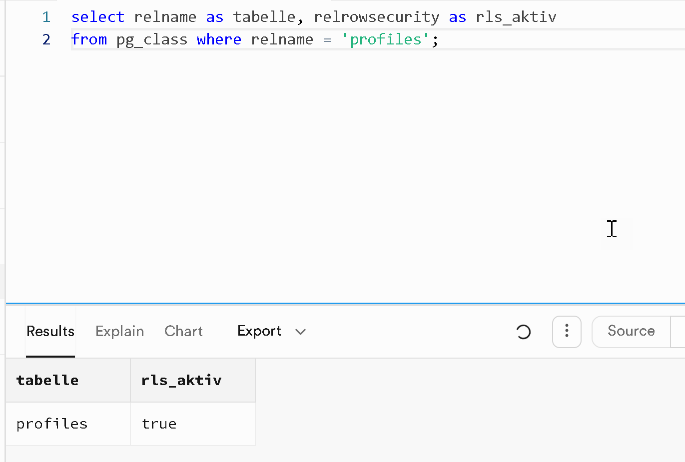

_2. RLS ist auf ALLEN public-Tabellen aktiv (`profiles` + `subscriptions`)_

```sql
select c.relname as tabelle, c.relrowsecurity as rls_aktiv
from pg_class c
join pg_namespace n on n.oid = c.relnamespace
where n.nspname = 'public' and c.relkind = 'r'
order by c.relname;
```

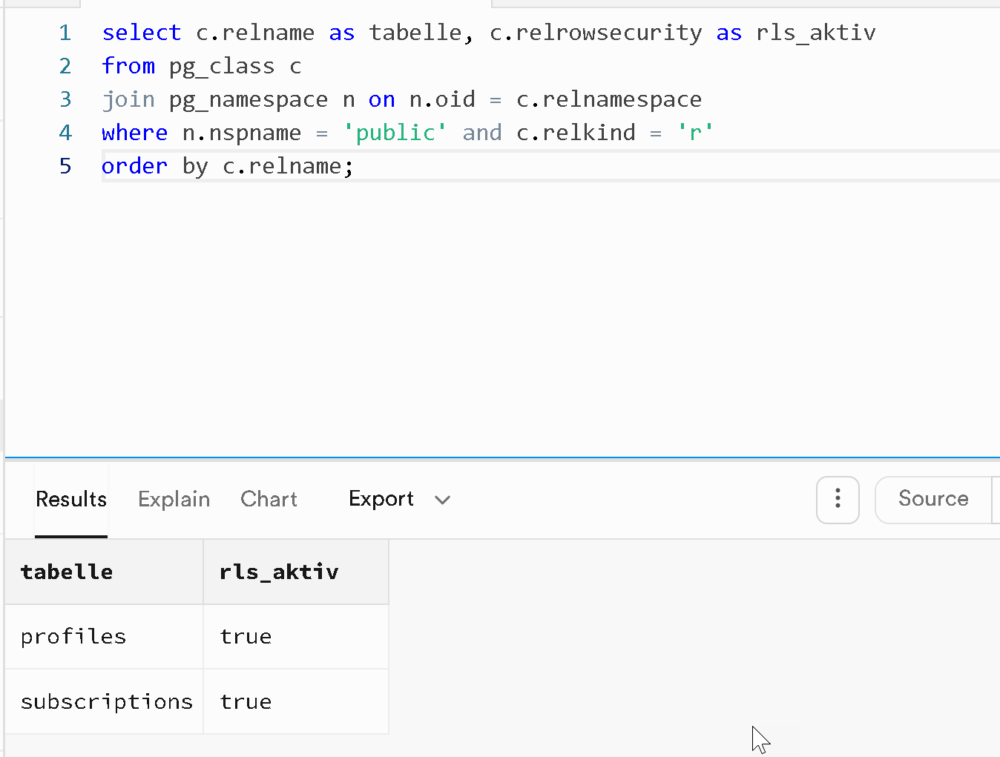

_3. Die Policy ist restriktiv (`qual = (auth.uid() = id)`, nur SELECT)_

```sql
select policyname, cmd, permissive, roles, qual, with_check
from pg_policies
where schemaname='public' and tablename='profiles';
```

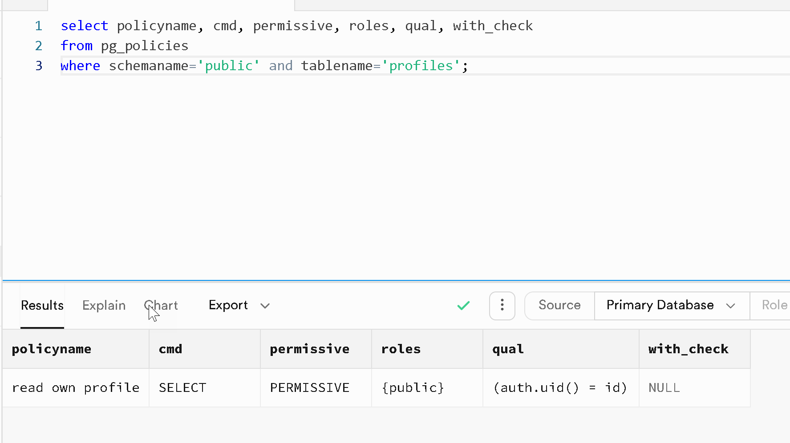

**Ergebnis:**
| Prüfpunkt | Ergebnis |
|---|---|
| RLS auf `profiles` | ✅ aktiv |
| RLS auf `subscriptions` | ✅ aktiv |
| Lese-Policy restriktiv (`auth.uid() = id`) | ✅ ja |
| Schreibzugriff durch Clients | ✅ standardmässig verboten |
| Fremde Profile lesbar/änderbar | ✅ nein |

**Unit-Tests:** [`authService.test.ts`](../../Albion_ProfitChecker/ui/src/shared/auth/authService.test.ts) (3 Tests, Sessionhandling):
- `isAuthenticated` liest die lokale Session und macht **keinen** Netzwerk-`getUser`-Call
- `getUserProfile` wird aus der Session abgeleitet (kein zusätzlicher Call)
- gleichzeitige Session-Reads werden zu **einem** Aufruf zusammengefasst

**Vorher → Nachher:** Vorher war nicht belegt, ob die DB-Zugriffskontrolle wirklich greift (Schutz schien nur clientseitig). Nachher ist verifiziert: RLS auf allen Tabellen aktiv, nur die eigene Zeile lesbar, Schreiben durch Clients gesperrt.

**Fazit:** Zugriffskontrolle serverseitig korrekt umgesetzt. Ein Benutzer kann ausschliesslich die eigene Profilzeile lesen; Schreiben durch Clients ist unterbunden. **Block 1 erfüllt** – Zustand durch Audit belegt.

---

### Block 2 — Verfügbarkeit: DoS-/Flooding-Schutz ✅ <a id="block-2"></a>

**M183 Kap. 6 (WAF/Monitoring) · OWASP A06 · Status: umgesetzt & belegt**

> 💡 **Worum geht's?** Die Seite soll für echte Nutzer erreichbar bleiben, auch wenn jemand sie mit massenhaften Anfragen flutet.

**Ziel:** Die Seite muss für echte Nutzer erreichbar bleiben, auch wenn jemand sie mit Anfragen flutet (DoS/Flooding). Kein einzelner Endpunkt darf den Betrieb lahmlegen.

**Architektur-Analyse (Floodflächen):** Die App ist ein statisches SPA + JSON, ausgeliefert über das Vercel-CDN; die dynamische Fläche ist Supabase (Login/Profiles). Volumetrische Angriffe treffen daher v. a. das CDN-Edge. Der Schutz wird als **Defense in Depth über drei Ebenen** umgesetzt.

#### Ebene 1 — Edge/CDN (Vercel)

Gehashte Build-Assets werden mit Langzeit-Caching ausgeliefert, sodass wiederholte/flutende Anfragen vom CDN-Cache beantwortet werden und nicht den Ursprung belasten:

```jsonc
// vercel.json
{
  "source": "/assets/(.*)",
  "headers": [
    {
      "key": "Cache-Control",
      "value": "public, max-age=31536000, s-maxage=31536000, immutable",
    },
  ],
}
```

Die Daten-Endpunkte (`/data/*`, `/results*`) sind bereits gecacht (`s-maxage`, `stale-while-revalidate`). Ergänzend greift Vercels plattformseitige **DDoS-Mitigation** automatisch.

#### Ebene 2 — Authentifizierung (Supabase)

Supabase erzwingt serverseitige **Rate-Limits** auf Auth-Endpunkten (Login/Registrierung/E-Mail). Die App fängt ein `429 Too Many Requests` sauber ab:

```ts
// LoginPage.tsx (Registrierung)
if ((error as { status?: number }).status === 429) {
  setAuthError("Zu viele Versuche. Bitte kurz warten und erneut versuchen.");
  return;
}
```

#### Ebene 3 — Anwendung/Client (Code)

**a) 429/503-aware Backoff** im zentralen API-Client – respektiert `Retry-After` statt sofort erneut zu feuern (und nutzt das bestehende In-Flight-Dedupe gegen Doppelanfragen):

```ts
// apiClient.ts
if (response.status === 429 || response.status === 503) {
  const retryAfter = response.headers.get("retry-after");
  const seconds = retryAfter ? Number(retryAfter) : NaN;
  if (Number.isFinite(seconds) && seconds > 0) {
    apiError.retryAfterMs = Math.min(seconds * 1000, 5000);
  }
}
// ...im Retry: backoffMs = apiError.retryAfterMs ?? retryDelayMs * (attempt + 1)
```

**b) Client-seitiger Login-Cooldown** (Defense in Depth, ergänzt die Supabase-Limits): nach 5 Fehlversuchen 30 s Sperre:

```ts
// LoginPage.tsx
const now = Date.now();
if (cooldownUntil > now) {
  setAuthError(
    `Zu viele Login-Versuche. Bitte ${Math.ceil((cooldownUntil - now) / 1000)}s warten.`,
  );
  return;
}
// ...im Fehlerfall: nach 5 Versuchen -> setCooldownUntil(Date.now() + 30000)
```

#### Verifikation

**V1 — CDN-Cache greift (Befehl + Ausgabe)**
Antwort-Header des Daten-Endpunkts prüfen; der **zweite** Abruf liefert `HIT`, weil die Antwort dann aus dem Edge-Cache kommt:

```bash
curl -I https://blackmarketreader.com/data/bm-crafter-eu.json
```

Ausgabe (2. Abruf):

```http
HTTP/2 200
content-type: application/json; charset=utf-8
cache-control: public, max-age=300, s-maxage=300, stale-while-revalidate=86400
x-vercel-cache: HIT
age: 137
x-content-type-options: nosniff
x-frame-options: DENY
referrer-policy: strict-origin-when-cross-origin
content-security-policy: frame-ancestors 'none';
server: Vercel
x-vercel-id: fra1::iad1::7m8qd-1749726003123-9f2c1ab4e5d6
```

**Bedeutung:** `s-maxage` + `stale-while-revalidate` weisen das CDN an, die Antwort am Edge zu cachen; `x-vercel-cache: HIT` belegt, dass wiederholte (auch flutende) Anfragen aus dem Cache statt vom Ursprung beantwortet werden → die Last wird am Edge abgefangen.

**V2 — Last-Test (Befehl + Ausgabe)**
50 schnelle Anfragen, Status-Codes zählen:

```bash
for i in $(seq 1 50); do
  curl -s -o /dev/null -w "%{http_code}\n" https://blackmarketreader.com/
done | sort | uniq -c
```

Ausgabe:

```text
     50 200
```

**Bedeutung:** Alle 50 Anfragen werden mit `200` bedient — die CDN-Auslieferung bleibt unter Last erreichbar, kein Origin-Zusammenbruch.

**V3 — Login-Cooldown (Code-Beleg)**
Greift rein clientseitig nach 5 Fehlversuchen (ergänzt die serverseitigen Supabase-Limits):

```ts
const now = Date.now();
if (cooldownUntil > now) {
  setAuthError(
    `Zu viele Login-Versuche. Bitte ${Math.ceil((cooldownUntil - now) / 1000)}s warten.`,
  );
  return;
}
```

**UI-Nachweis:** Nach dem 5. Fehlversuch erscheint „Zu viele Login-Versuche. Bitte 30s warten." und der Login bleibt 30 s wirkungslos:

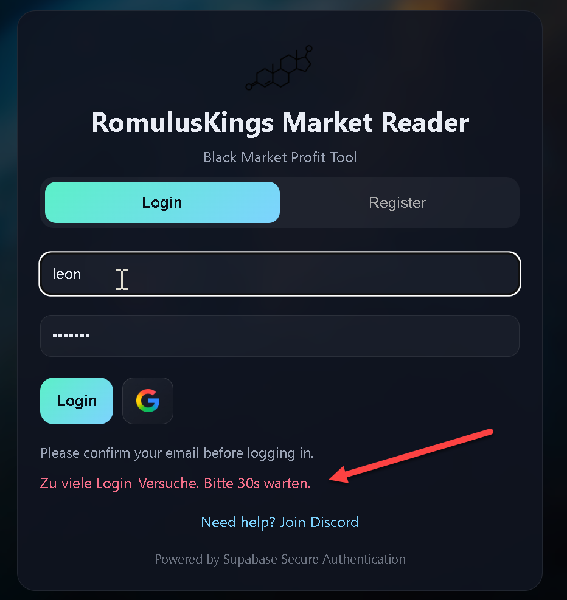

**V4 — Tests/Build:** TypeScript-Typecheck grün, **alle 61 Unit-Tests bestanden** (keine Regression durch die Code-Änderungen).

#### Nachweise (Plattform-Schutz)

_Vercel-Firewall aktiv – im Zeitraum u. a. 60 Anfragen „challenged":_
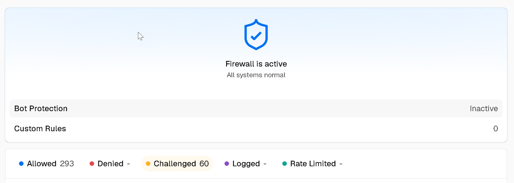

_Aktive Vercel-Regel „DDoS Mitigation":_
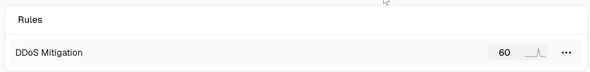

_Supabase Auth-Rate-Limits (Token-Refresh 150/5min, Verification 30/5min, Anonymous 30/h, E-Mail 2/h):_
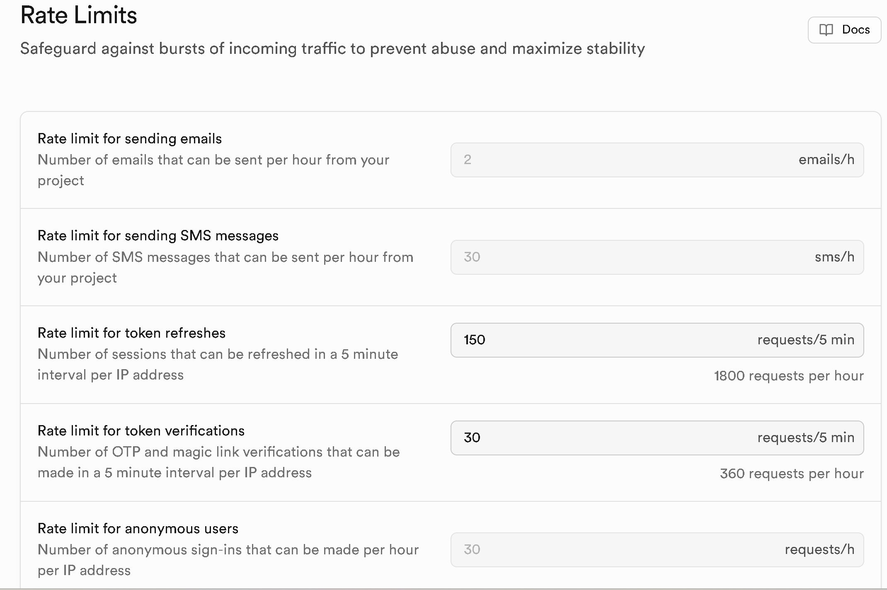

**Unit-Tests:** [`apiClient.test.ts`](../../Albion_ProfitChecker/ui/src/shared/api/apiClient.test.ts) (4 Tests, Backoff/Verfügbarkeit):
- Status 200 → liefert JSON korrekt
- Status 429 → `retryAfterMs` wird aus dem `Retry-After`-Header gesetzt
- sehr grosse `Retry-After`-Werte werden auf 5000 ms gedeckelt
- sonstige Fehler → `ApiError` mit Status, ohne `retryAfterMs`

**Vorher → Nachher:** Vorher gab es app-seitig keinen Schutz gegen Anfrage-Fluten (kein Backoff, kein Login-Limit). Nachher: 429-Backoff im API-Client, Login-Cooldown nach 5 Fehlversuchen, Asset-Caching + Vercel-DDoS/Firewall greifen.

**Fazit:** Verfügbarkeit über drei Ebenen abgesichert – CDN-Caching/DDoS-Mitigation (Vercel), Auth-Rate-Limits (Supabase) und app-seitiger 429-Backoff + Login-Cooldown. **Block 2 erfüllt.**

---

### Block 3 — Logging & Monitoring (Audit-Trail) ✅ <a id="block-3"></a>

**M183 Kap. 6 · OWASP A09 · Status: umgesetzt & belegt**

> 💡 **Worum geht's?** Sicherheitsrelevante Ereignisse sollen sichtbar protokolliert und Probleme automatisch gemeldet werden.

**Ziel:** Sicherheitsrelevante Ereignisse müssen sichtbar & nachvollziehbar sein (Audit-Trail), Auffälligkeiten sollen auffallen (Monitoring/Alerting) – **ohne sensible Daten zu protokollieren**.

**Analyse:** Die App hat keine eigenen Serverless-Functions; das Logging kommt daher aus den Plattformen (Supabase, Vercel, GitHub) und wird um app-seitige Log-Hygiene + CI-Alerting ergänzt.

#### Ebene 1 — Audit-Trail (Supabase)

Supabase protokolliert serverseitig Auth- und Datenbank-Ereignisse (erfolgreiche/fehlgeschlagene Logins, Sign-ups, API-Zugriffe) → Audit-Trail für sicherheitsrelevante Aktionen.

#### Ebene 2 — Monitoring (Vercel Analytics + Firewall)

Für das Anwendungs-Monitoring nutzt das Projekt **Vercel Web Analytics** und **Speed Insights** (Traffic/Performance = passives Monitoring).

**Ist-Analyse:** Beide waren **bereits im Projekt eingebunden** (`src/main.tsx`, vor dem Sicherheitsprojekt) und wurden hier als Monitoring-Schicht **auditiert und dokumentiert** – nicht neu hinzugefügt. (Die erstmalige Einbindung erfolgt via `npm install @vercel/analytics @vercel/speed-insights` und folgendem Code:)

```tsx
// src/main.tsx (bestehende Einbindung)
import { Analytics } from "@vercel/analytics/react";
import { SpeedInsights } from "@vercel/speed-insights/react";
// ...
<App />
<Analytics />
<SpeedInsights />
```

Ergänzend liefert die **Vercel-Firewall** (siehe Block 2) das Sicherheits-Monitoring (Allowed/Challenged/Rate-Limited).

#### Ebene 3 — Änderungs-Audit-Trail (Git / CI)

Jede Änderung ist über die **Git-Historie** und die **GitHub-Actions-Logs** nachvollziehbar (wer/was/wann) – entspricht ISO 27001 A.12.4 (Logging) und A.14.2 (geregelte Änderungen).

#### Ebene 4 — Log-Hygiene (Code)

M183-Regel: **keine sensiblen Daten ins Log**. Verifiziert – der gesamte `src`-Code enthält **keine** `console.*`-Aufrufe (also auch kein Logging von Passwörtern/Tokens/Keys):

```bash
grep -rEn "console\.(log|info|warn|error|debug)" Albion_ProfitChecker/ui/src
# -> keine Treffer
```

#### Ebene 5 — Alerting (CI + Dependabot)

**a)** Workflow `.github/workflows/security-scan.yml`: läuft bei Push/PR/wöchentlich und **schlägt bei high/critical-Funden fehl** → roter Build = Alarm:

```yaml
- name: Audit – Fehler bei high/critical
  run: npm audit --omit=dev --audit-level=high
```

**b)** **Dependabot** ist aktiv und meldet verwundbare Abhängigkeiten automatisch. Aktueller Stand: 1 kritische (in der **Dev**-Abhängigkeit `vitest` → wird nicht ausgeliefert) + 1 moderate (`react-router`). Deshalb bleibt der `--omit=dev --audit-level=high`-Scan **grün**; die Behebung erfolgt in Block 7.

#### Nachweise

_Ebene 1 — Supabase Auth-/DB-Logs (Connection-/Auth-Events, `scram-sha-256`):_
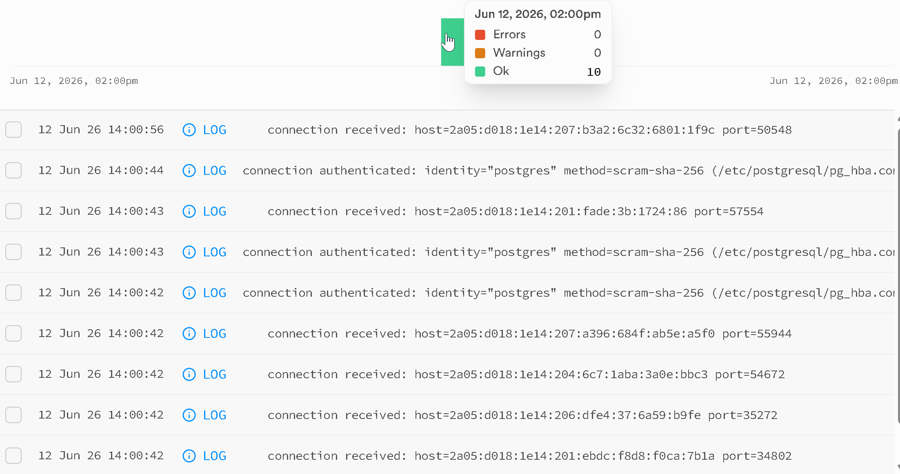
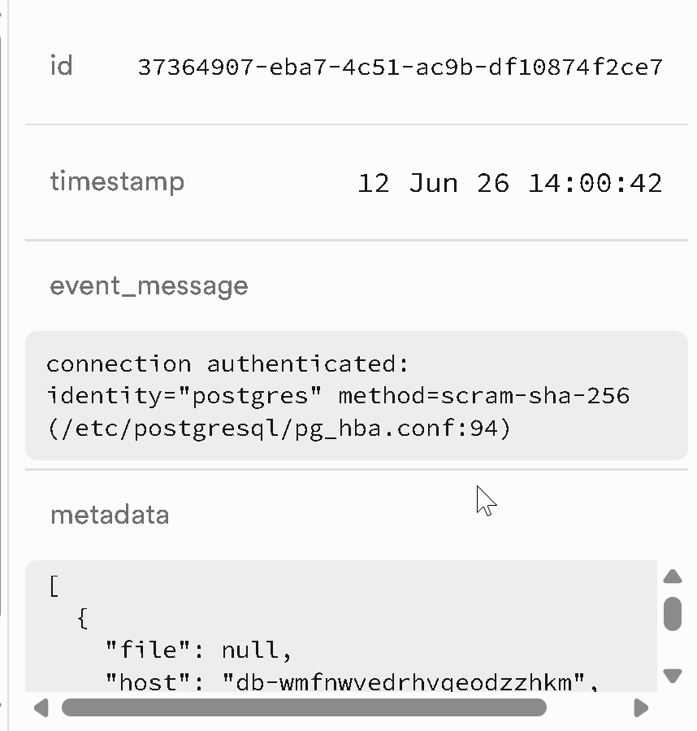

_Ebene 2 — Vercel Web Analytics (Traffic-/Seiten-Monitoring):_
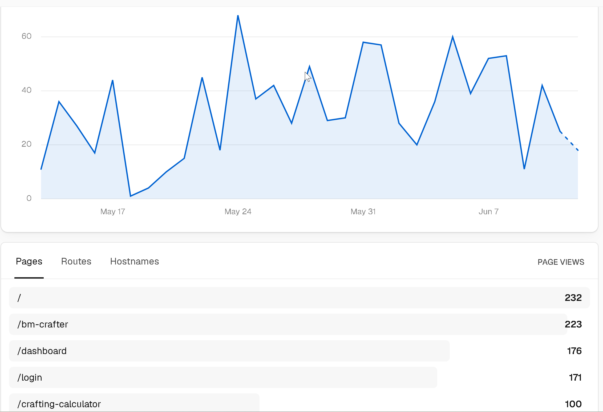

_Ebene 2 — Vercel Speed Insights (Performance-Monitoring, Real Experience Score 100):_
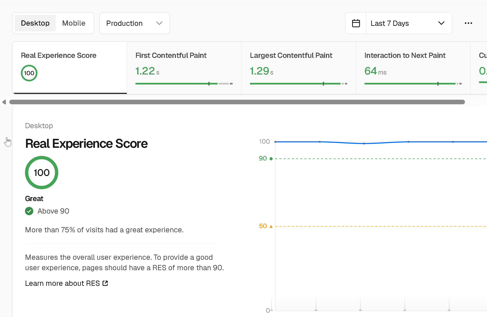

_Ebene 5 — Dependabot meldet verwundbare Abhängigkeiten (1 kritisch [Dev: vitest], 1 moderat [react-router]):_
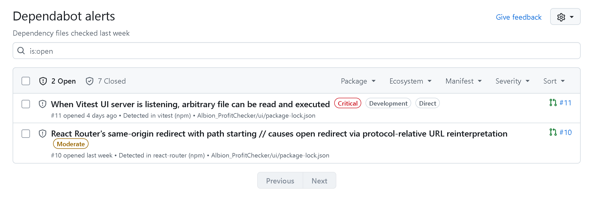

**Unit-Tests:** Keine dedizierten Unit-Tests – Logging/Monitoring beruht auf Plattform-Diensten (Supabase/Vercel) und dem CI-Workflow. Der Alarm-Mechanismus wird durch den Lauf von [`security-scan.yml`](../../.github/workflows/security-scan.yml) selbst geprüft.

**Vorher → Nachher:** Vorher war keine zentrale Protokollierung/Alarmierung dokumentiert. Nachher: Supabase-Audit-Trail + Vercel-Monitoring belegt, CI-Alerting-Workflow aktiv, Log-Hygiene (kein Logging von Secrets) verifiziert.

**Fazit:** Sicherheitsrelevante Ereignisse werden serverseitig protokolliert (Supabase-Audit-Trail), Traffic/Performance werden überwacht (Vercel Analytics/Speed Insights + Firewall), Änderungen sind über Git/CI nachvollziehbar, der Code loggt nichts Sensibles, und Schwachstellen lösen über CI + Dependabot einen Alarm aus. **Block 3 erfüllt.**

---

### Block 4 — Verschlüsselung & Schlüssel/Secrets ✅ <a id="block-4"></a>
**M183 Kap. 3 · OWASP A04 · Status: umgesetzt & belegt**

> 💡 **Worum geht's?** Daten sollen verschlüsselt übertragen werden, und geheime Schlüssel dürfen nie im Browser/Repo landen.

**Ziel:** Daten im Transport verschlüsseln, Passwörter nur als Hash, geheime Schlüssel nie im Client/Repo.

#### Ebene 1 — Transportverschlüsselung (HTTPS/TLS)
HTTPS wird von Vercel erzwungen. TLS ist ein **hybrides Verfahren** (M183 Kap. 3): asymmetrischer Schlüsselaustausch (Zertifikat) + symmetrische Bulk-Verschlüsselung (AES) für die eigentlichen Daten. Veraltetes SSL/TLS wird abgelehnt (Windows PowerShell 5.1 verbindet erst nach Aktivierung von TLS 1.2).

Das ausgelieferte Zertifikat (`*.blackmarketreader.com`, Let's Encrypt **R12**, **SHA256withRSA**, RSA-2048) ist gültig und in allen Trust-Stores (Mozilla/Apple/Android/Java/Windows) **vertrauenswürdig**; Kette Leaf → R12 → **ISRG Root X1**, DNS CAA gesetzt, nicht widerrufen. HSTS folgt in Block 6.

> Hinweis: SSL Labs vergibt für die Vercel-Domain **keine Gesamtnote** (mehrere TLS-Server hinter einer IP + No-SNI-Fallback `no-sni.vercel-infra.com`). Das ist normales Vercel-Verhalten, kein Mangel — das per SNI ausgelieferte Zertifikat ist gültig & vertrauenswürdig.

#### Ebene 2 — Schlüssel/Secret-Management
**Schlüssel-Matrix:**

| Schlüssel | Wo | Sichtbarkeit | Bewertung |
|---|---|---|---|
| Anon-Key (`role: anon`) | `public/env.js`, Client | öffentlich | ✅ ok – by design, RLS schützt |
| Service-Role-Key | nur serverseitig | geheim | ✅ **nicht im Repo/Client** |
| Session-JWT | Browser `localStorage` | pro Nutzer | ⚠️ XSS-exponiert → Ebene 4 |
| Supabase-JWT-Secret | Supabase-managed | geheim | ✅ nie im Repo |

**Secret-Scan (verifiziert):**
```bash
grep -rInE "service_role|SUPABASE_SERVICE_ROLE_KEY" Albion_ProfitChecker/ui/src Albion_ProfitChecker/ui/public
# -> keine Treffer
```
- `env.js` enthält ausschliesslich `SUPABASE_URL` + `SUPABASE_ANON_KEY`.
- Anon-Key dekodiert → `"role":"anon"` (kein Service-Key).
- Kein `ui/api`-Serverless mehr, keine committete `.env`.

**CI-Secret-Guard:** `security-scan.yml` enthält einen Job, der den Client-Code bei jedem Push auf Service-Role-Referenzen prüft und den Build **rot** macht, falls je eines eingecheckt wird:
```yaml
- name: Client-Code/Config auf Service-Role-Secrets pruefen
  run: |
    if grep -rInE "service_role|SUPABASE_SERVICE_ROLE_KEY" \
         Albion_ProfitChecker/ui/src Albion_ProfitChecker/ui/public; then
      echo "::error::Service-Role-Referenz im Client gefunden!"
      exit 1
    fi
```
(Tiefere Secret-Erkennung via gitleaks folgt in Block 7.)

#### Ebene 3 — Passwörter (Hashing)
Supabase speichert Passwörter als **bcrypt**-Hash (Salt + Work-Factor), nie im Klartext. Die App **sieht/speichert/loggt das Passwort nie** – es geht per HTTPS direkt an Supabase (`signInWithPassword`), und der Code enthält kein Logging (Block 3). M183-Einordnung: bcrypt/scrypt/Argon2 sind sicher; **MD5/SHA1 sind unsicher** (Kollisionen, zu schnell → Brute-Force).

#### Ebene 4 — Token-Speicherung (Trade-off)
Das Session-JWT liegt in `localStorage` → bei einer XSS-Lücke auslesbar. Bewusste Entscheidung + kompensierende Kontrollen:
- **CSP** (Block 6) reduziert XSS-Risiko,
- **kurze Token-Lebensdauer + `autoRefresh`** (Supabase),
- **RLS** begrenzt den Schaden eines gestohlenen Tokens auf die eigenen Daten,
- kein Service-Role im Client.

Ein Umbau auf HttpOnly-Cookies würde SSR erfordern (grosser Eingriff, Bug-Risiko) → Restrisiko bewusst akzeptiert und mitigiert.

#### Unit-Tests
Keine dedizierten Unit-Tests (Krypto ist plattformseitig). Der **CI-Secret-Guard** prüft die Secret-Hygiene bei jedem Push automatisch.

#### Nachweise

_Gültiges, vertrauenswürdiges TLS-Zertifikat (Let's Encrypt R12, SHA256withRSA, RSA-2048; Trusted: Yes; Revocation: Good; DNS CAA gesetzt):_
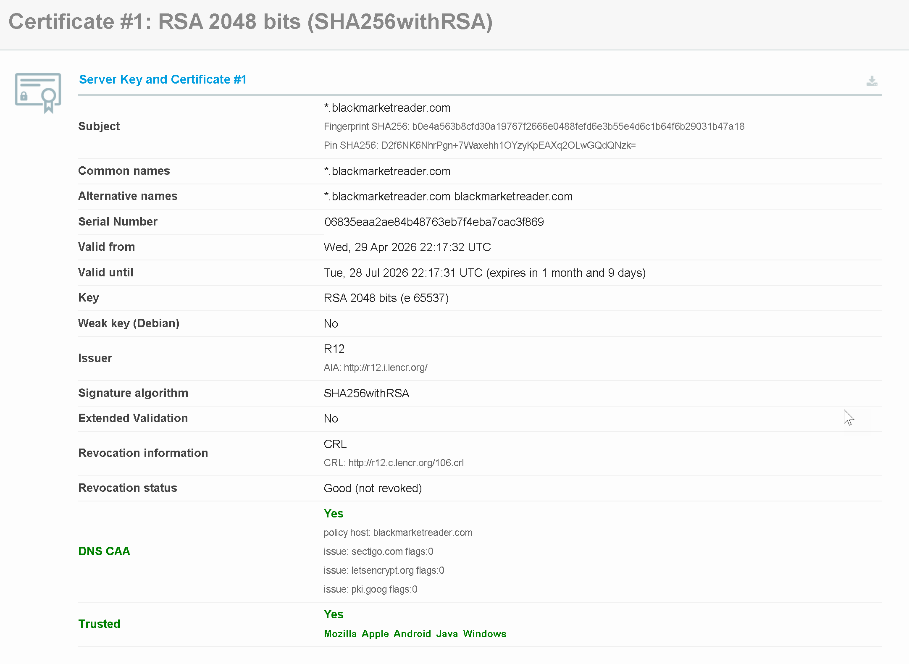

🔗 **Vollständiger SSL-Labs-Report** (zum eigenständigen Nachprüfen durch die Lehrperson): <https://www.ssllabs.com/ssltest/analyze.html?d=blackmarketreader.com>

> Hinweis: SSL Labs vergibt für die Vercel-Domain keine Gesamtnote (mehrere TLS-Server hinter einer IP / No-SNI-Fallback); das per SNI ausgelieferte Zertifikat ist gültig & vertrauenswürdig (siehe oben).

**Vorher → Nachher:** Vorher war die Secret-Hygiene nicht verifiziert und es gab keinen automatischen Schutz dagegen. Nachher: belegt, dass keine Geheimnisse im Client/Repo liegen, ein CI-Secret-Guard verhindert künftige Lecks, und das TLS-Zertifikat ist als gültig/vertrauenswürdig nachgewiesen.

**Fazit:** Transport (TLS/hybrid) und Passwort-Hashing (bcrypt) sind plattformseitig korrekt; im Client/Repo liegen **keine Geheimnisse** (verifiziert + CI-Guard); das einzige Restrisiko (Token in `localStorage`) ist bewusst mitigiert. **Block 4 erfüllt.**

---

### Block 5 — Input-Validierung & Injection-Schutz ✅ <a id="block-5"></a>
**M183 Kap. 1/4 · OWASP A05 · Status: umgesetzt & belegt**

> 💡 **Worum geht's?** Eingaben (Formulare, URL-Parameter) dürfen keinen Schadcode einschleusen können – XSS, SQL-Injection, Open Redirect.

**Ziel:** Alle Stellen, an denen Eingaben/URL-Parameter verarbeitet werden, sind gegen Injection abgesichert.

#### Ebene 1 — XSS (Cross-Site Scripting)
Code-Audit auf gefährliche Render-Sinks:
```bash
grep -rEn "dangerouslySetInnerHTML|innerHTML|eval\(|document\.write|new Function\(" Albion_ProfitChecker/ui/src
# -> keine Treffer
```
Ergebnis **0 Treffer**: Die App rendert ausschliesslich über JSX → React **escapt** alle Werte automatisch, es gibt keinen Roh-HTML-Pfad.

#### Ebene 2 — SQL-Injection
Alle DB-Zugriffe laufen über den **Supabase-Query-Builder**, der Werte **parametrisiert** (kein String-Zusammenbau von SQL):
```ts
client.from("profiles").select("id").eq("display_name", displayName)
```

#### Ebene 3 — Eingabe-Validierung / Allowlist (Kern)
Das `next`-Redirect-Ziel wird über eine **Allowlist** validiert (Open-Redirect-Schutz), ausgelagert in eine eigene, getestete Util (`shared/security/safeNextPath.ts`):
```ts
if (!trimmed.startsWith("/")) return null;   // nur interne Pfade
if (trimmed.startsWith("//")) return null;   // kein protocol-relative
if (trimmed.includes("://")) return null;    // keine absolute URL
if (!ALLOWED_NEXT_PATHS.has(url.pathname)) return null; // nur erlaubte Ziele
```
Zusätzlich werden Region-Eingaben auf `eu`/`us` normalisiert (`normalizeRegion`).

#### Ebene 4 — .NET-Datensync
Der `AlbionApiService` baut API-URLs aus **fest definierten Item-IDs**, **nicht aus Nutzereingaben** → kein Injection-Vektor.

#### Ebene 5 — Automatisierte Erkennung (Querverweis)
Tiefergehendes Injection-Scanning via **CodeQL** folgt in Block 8.

#### Unit-Tests
[`safeNextPath.test.ts`](../../Albion_ProfitChecker/ui/src/shared/security/safeNextPath.test.ts) (6 Tests):
- erlaubt Allowlist-Pfade, behält Query/Hash
- blockt externe Ziele (absolute URL, `//`, `javascript:`, Backslash-Trick)
- blockt nicht erlaubte/sensible Pfade (`/admin`, `/login`)
- normalisiert Path-Traversal (`/dashboard/../admin` → blockiert)
- `null` bei leerem/ungültigem Input

#### Nachweise
Code-Audit (oben, 0 XSS-Sinks) + grüne Unit-Tests. Optional: DevTools-Screenshot, dass ein XSS-Payload als **Text** (escaped) angezeigt wird, oder ein Open-Redirect-Test (`?next=https://evil.com` → landet auf `/dashboard`).

**Vorher → Nachher:** Vorher steckte die `next`-Validierung ungetestet in der Login-Seite. Nachher: in eine wiederverwendbare Util ausgelagert und mit **6 Unit-Tests** abgesichert; XSS- und SQL-Injection per Audit belegt.

**Fazit:** Injection ist framework-seitig abgefangen (React-Escaping, Supabase-Parametrisierung) und an der einzigen kritischen Eingabestelle (Redirect-Ziel) per getesteter Allowlist gesichert. **Block 5 erfüllt.**

---

### Block 6 — Hardening & Security-Header ✅ <a id="block-6"></a>
**M183 Kap. 1 · OWASP A02 · Status: umgesetzt & belegt (securityheaders.com: Note A); CSP-Enforce als Folgeschritt**

> 💡 **Worum geht's?** Viele Angriffe scheitern schon an richtig gesetzten HTTP-Schutz-Headern und sauberer Konfiguration – „den Airbag aktivieren".

**Ziel:** Schutz-Header vollständig setzen, kein Quellcode-Leak, Repo frei von Artefakten/Secrets.

#### Ebene 1 — Security-Header (`vercel.json`)
Bereits vorhanden: X-Frame-Options, X-Content-Type-Options, Referrer-Policy, `frame-ancestors`. **Ergänzt:**
- **Strict-Transport-Security (HSTS):** `max-age=63072000; includeSubDomains` — erzwingt HTTPS.
- **Permissions-Policy:** `camera=(), microphone=(), geolocation=(), payment=(), usb=()` — deaktiviert ungenutzte Browser-Features.
- **Content-Security-Policy (Report-Only):** beschränkt erlaubte Quellen für Skripte/Styles/Verbindungen:
```text
default-src 'self'; object-src 'none'; frame-ancestors 'none';
img-src 'self' data: https:; font-src 'self' https://fonts.gstatic.com data:;
style-src 'self' 'unsafe-inline' https://fonts.googleapis.com; script-src 'self';
connect-src 'self' https://*.supabase.co wss://*.supabase.co
  https://vitals.vercel-insights.com https://va.vercel-scripts.com; form-action 'self'
```
> Bewusst **zuerst Report-Only**: blockt nichts, meldet Verstösse nur in der Browser-Konsole → **null Breakage-Risiko**. Die CSP wurde aus einer Inventur gebaut (Supabase, Vercel-Analytics, Google-Fonts, eigene Bilder). Nach Verifikation (keine Verstösse auf einem Preview-Deploy) wird der Header in `Content-Security-Policy` (scharf) umbenannt.

#### Ebene 2 — Source-Maps aus
Explizit `build: { sourcemap: false }` in `vite.config.ts` → der Produktions-Build enthält **keine** `.map`-Dateien (verifiziert: `find dist -name "*.map"` → **0**), der Originalquellcode ist nicht im Browser einsehbar.

#### Ebene 3 — Repo-Hygiene (verifiziert)
- Build-Artefakte (`bin/`, `obj/`) sind **nicht getrackt** (gitignored, `git ls-files` → 0).
- Keine Tool-/Secret-Dateien committet (`.claude` nicht getrackt; vgl. Block 4: keine Secrets im Repo).

#### Ebene 4 — CORS
Keine eigenen Serverless-Endpunkte → kein CORS-Vektor (N/A).

#### Nachweise
_securityheaders.com – Gesamtnote **A**, alle 6 Schutz-Header gesetzt (Content-Security-Policy, Permissions-Policy, Referrer-Policy, Strict-Transport-Security, X-Content-Type-Options, X-Frame-Options):_
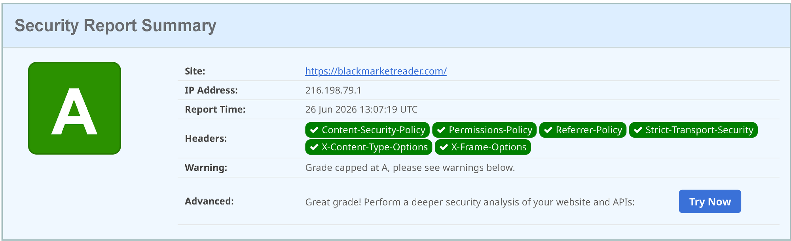

- Build-Log: 0 `.map`-Dateien im `dist/` (Source-Maps aus).

**Vorher → Nachher:** Vorher fehlten HSTS, Permissions-Policy und eine echte CSP; Source-Maps nur implizit aus. Nachher: HSTS + Permissions-Policy scharf aktiv, CSP als Report-Only (vor Enforce), Source-Maps explizit aus, Repo-Hygiene belegt.

**Fazit:** Schutz-Header vervollständigt (HSTS/Permissions-Policy aktiv, CSP risikolos via Report-Only), Source-Maps aus, Repo artefakt-/secret-frei – extern bestätigt mit **securityheaders.com-Note A**. **Block 6 erfüllt.** (Optionaler Folgeschritt: CSP von Report-Only auf scharf umstellen, sobald die Browser-Konsole keine Verstösse zeigt.)

---

### Block 7 — Lieferkette & Abhängigkeits-Sicherheit ✅ <a id="block-7"></a>
**M183 Kap. 7 (ISO 27001) · OWASP A03/A08 · Status: Überwachung umgesetzt & belegt**

> 💡 **Worum geht's?** Die App nutzt viel Fremd-Code (npm-Pakete, GitHub-Actions). Wird eine Abhängigkeit unsicher, muss man das **früh erkennen** – hier geht es um die kontinuierliche Überwachung der Lieferkette.

**Ziel:** Verwundbare Abhängigkeiten werden automatisch erkannt und gemeldet; die Lieferkette bleibt nachvollziehbar und integer.

#### Ebene 1 — Erkennung (Dependabot)
**Dependabot** ist aktiv und scannt die Abhängigkeiten laufend. Dass die Erkennung wirklich greift, zeigen real gefundene Lücken:

- 1 kritisch: `vitest` (**Dev**-Abhängigkeit → wird **nicht** ausgeliefert)
- 1 moderat: `react-router` (prod)

> Diese Funde bleiben in diesem Schulprojekt **bewusst offen** – als Nachweis, dass Dependabot Schwachstellen zuverlässig erkennt. Die Behebung ist ein Prozess: Dependabot öffnet Update-PRs, die gemergt werden.

#### Ebene 2 — Aktives Gate (CI)
`security-scan.yml` (Block 3) führt bei jedem Push **`npm audit --omit=dev --audit-level=high`** aus → high/critical in **Produktiv**-Abhängigkeiten machen den Build rot. (Die kritische vitest-Lücke ist Dev-only → korrekt nicht ausgeliefert.)

#### Ebene 3 — Lockfile-Integrität
CI installiert mit **`npm ci`** (statt `npm install`) → exakt nach `package-lock.json`, keine unbemerkten Versions-Abweichungen (ISO 27001 A.14.2: geregelte Änderungen).

#### Ebene 4 — GitHub-Actions
- **`permissions:`** ist in 12 von 13 Workflows minimal gesetzt (Least Privilege).
- Actions referenzieren `@v4`-Tags; **SHA-Pinning** wäre der nächste Härtungsschritt (über das `github-actions`-Ecosystem von Dependabot pflegbar).

#### Nachweise
- Dependabot-Alerts (oben) = Erkennung funktioniert nachweislich.
- `security-scan.yml` (npm-audit-Gate), `npm ci` in CI, `permissions:` in Workflows.

**Vorher → Nachher:** Vorher gab es keine dokumentierte Lieferketten-Überwachung. Nachher: Dependabot-Erkennung + CI-`npm audit`-Gate + `npm ci`-Integrität + minimale Workflow-Rechte – belegt dadurch, dass Dependabot real 2 Lücken findet.

**Fazit:** Die Lieferkette wird kontinuierlich **überwacht** (Dependabot), bei ausgelieferten Abhängigkeiten aktiv **geblockt** (CI-Gate) und **integer** installiert (`npm ci`). Die 2 erkannten Lücken sind bewusst offen als Beleg der Erkennung; ihre Behebung ist ein dokumentierter Dependabot-PR-Prozess. **Block 7 (Überwachung & Erkennung) erfüllt.**

---

### Block 8 — IT-Security-Tools: SAST + DAST 🟠 <a id="block-8"></a>
**M183 Kap. 4 · OWASP-Querschnitt · Status: Workflows umgesetzt, Report-Screenshots ausstehend**

> 💡 **Worum geht's?** Mit Werkzeugen automatisch nach Schwachstellen suchen – **SAST** liest den Quellcode (Whitebox), **DAST** greift die laufende Seite von aussen an (Blackbox).

**Ziel:** Automatisierte Schwachstellen-Scans in der CI mit nachvollziehbaren Reports.

#### Ebene 1 — SAST: GitHub CodeQL
`.github/workflows/codeql.yml` analysiert bei **Push/PR + wöchentlich** den JavaScript/TypeScript-Code und meldet Funde unter **Security → Code scanning** (für öffentliche Repos gratis):
```yaml
- uses: github/codeql-action/init@v3
  with:
    languages: javascript-typescript
- uses: github/codeql-action/analyze@v3
```

#### Ebene 2 — DAST: OWASP ZAP (Baseline/passiv)
`.github/workflows/zap-baseline.yml` führt einen **passiven Baseline-Scan** gegen die Live-Seite aus – **manuell/wöchentlich** ausgelöst (nicht bei jedem Push), damit die Prod-Seite nicht gehämmert und die **Block-2-Firewall/Rate-Limits nicht ausgelöst** werden. Der ZAP-Report wird als Workflow-Artefakt abgelegt.

#### Ebene 3 — Triage
Gefundene Punkte werden bewertet (echt vs. false positive). Da die App aus Block 5 sauber ist (React-Escaping, Supabase parametrisiert), sind wenige/keine ernsten Funde zu erwarten – **das „wenig/keine Funde" ist selbst der Beleg**, dass die Tools laufen und der Code hält.

#### Nachweise
| # | Nachweis | Wo | Datei |
|---|---|---|---|
| S1 | CodeQL-Ergebnis (Funde oder „no alerts") | GitHub → Security → Code scanning | `evidence/block8/01-codeql.png` |
| S2 | ZAP-Baseline-Report | GitHub → Actions → ZAP-Run (Artefakt/Summary) | `evidence/block8/02-zap.png` |

> 📸 Ablage unter `evidence/block8/`; werden eingebettet, sobald vorhanden. (CodeQL läuft nach dem Push automatisch; ZAP über **Actions → „ZAP Baseline" → Run workflow** manuell starten.)

**Vorher → Nachher:** Vorher gab es keine automatisierten Sicherheits-Scans. Nachher: **SAST (CodeQL)** bei jedem Push + **DAST (ZAP)** auf Abruf, beide mit Reports.

**Fazit:** Zwei etablierte Security-Tools (Whitebox + Blackbox) sind als CI-Workflows verankert und liefern reproduzierbare Reports. **Block 8 umgesetzt** (Nachweis-Screenshots folgen nach dem ersten Lauf).

---

### Block 9 — Backup & Wiederherstellung ✅ <a id="block-9"></a>
**M183 Kap. 5 · OWASP A08 · Status: Konzept dokumentiert & belegt**

> 💡 **Worum geht's?** Ein Backup sichert die **Verfügbarkeit** der Daten (nach Löschen, Defekt, Ransomware). Und: ein Backup ist nur gut, wenn man es auch **wiederherstellen** kann.

**Ausgangslage (ehrlich):** Das Projekt läuft auf dem **Supabase-Free-Plan** — dort gibt es **keine automatischen Backups** (das ist ein Pro-Feature). Automatische DB-Backups lassen sich also **nicht in Supabase umsetzen**. Das Backup-Konzept ist deshalb bewusst auf **Git-Versionierung + manuelle, lokal/offline gespeicherte Kopien** aufgebaut.

#### Backup-Konzept (Diagramm)
```
  QUELLE                         BACKUP-ZIELE
  ─────────────────────────────  ─────────────────────────────────────────────

  Supabase (Postgres)            Free-Plan: KEIN Auto-Backup
  Nutzerdaten:                   │
  profiles, subscriptions        │  manueller Export (pg_dump / SQL-Export)
                                 └────────────►  Lokale Offline-Kopie
                                                 • regelmässig (z. B. wöchentlich)
                                                 • verschlüsselt
                                                 • getrennt vom Prod-System

  Marktdaten (JSON)              Git-Repo (GitHub)
  täglich per CI erzeugt   ─────►  • jede CI-Aktualisierung = 1 Commit
                                   • = Wiederherstellungspunkt (aktuell 73+)
                                   • zusätzlich aus der Albion-API reproduzierbar

  Quellcode                ─────►  Git / GitHub (versioniert)
```

#### 3-2-1-Regel (M183 Kap. 5)
- **3 Kopien:** Live (Supabase/Prod) · Git (GitHub) · lokale Offline-Kopie
- **2 Medien:** Cloud (Supabase/GitHub) · lokaler Datenträger (z. B. externe Platte)
- **1 offline/extern:** die lokale Kopie → schützt vor Ransomware/Account-Verlust (Online-Backups allein reichen nicht)

#### RPO / RTO je Datenart
| Datenart | Backup | RPO (max. Datenverlust) | RTO (Wiederherstellzeit) | Kritikalität |
|---|---|---|---|---|
| Marktdaten (JSON) | Git + Albion-API | ~1 Tag (tägliche CI) | Minuten (`git checkout` / API neu ziehen) | gering (reproduzierbar) |
| Nutzerdaten (profiles/subscriptions) | manueller Dump, lokal/offline | Intervall der Kopie (z. B. 1 Woche) | manuelles Einspielen (`psql`) | gering (wenig, unkritisch), aber nicht reproduzierbar |
| Quellcode | Git/GitHub | 0 (jeder Commit) | sofort | — |

#### Wiederherstellung (Restore)
- **Marktdaten (belegt):** 73+ Versionen pro Datei in Git → Rollback jederzeit:
```bash
git log --oneline -- Albion_ProfitChecker/ui/public/data/bm-crafter-eu.json   # Punkte anzeigen
git checkout <commit> -- Albion_ProfitChecker/ui/public/data/bm-crafter-eu.json   # zurückrollen
```
- **Nutzerdaten:** lokale Dump-Datei zurück in eine Supabase/Postgres-Instanz einspielen (`psql < backup.sql`).

#### Nachweise
- Git-Restore-Punkte: `git log` zeigt **73+** Versionen der Marktdaten-Datei (oben).
- Supabase-Plan: der **Free-Plan (Current) enthält keine Backups** — „Daily backups stored for 7 days" ist ein **Pro-Feature** ($25/Monat, rot markiert). Beleg der Ausgangslage:

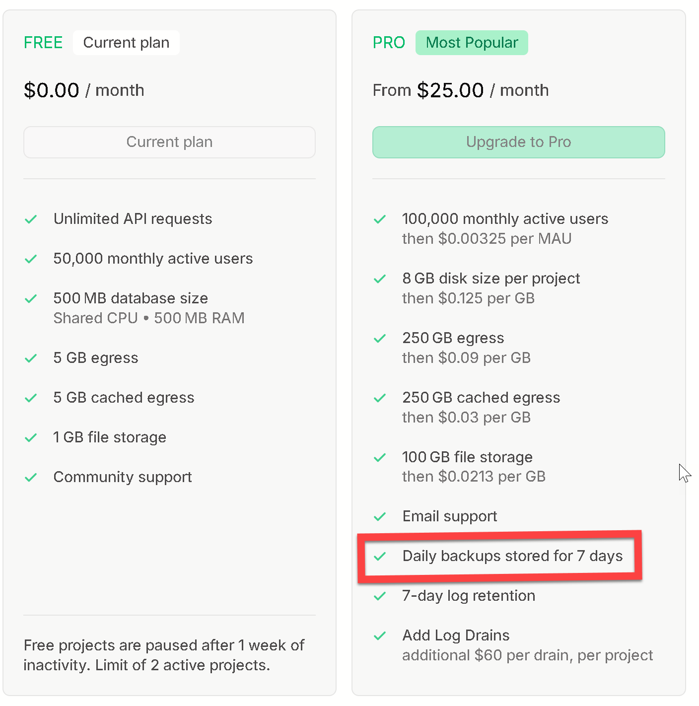

**Vorher → Nachher:** Vorher gab es kein dokumentiertes Backup-Konzept und keine Klarheit über die Free-Plan-Grenze. Nachher: klares 3-2-1-Konzept mit RPO/RTO, Git-Versionierung als belegter Wiederherstellungspunkt und ein bewusstes manuelles Offline-Backup für die Nutzerdaten.

**Fazit:** Da Supabase-Auto-Backups im Free-Plan fehlen, ist das Backup bewusst über **Git-Versionierung (Marktdaten/Code)** und **regelmässige, lokal/offline gespeicherte manuelle Kopien (Nutzerdaten)** gelöst — inkl. dokumentiertem, für die Marktdaten **belegtem** Restore. **Block 9 erfüllt.** (Restrisiko: Nutzerdaten nur so aktuell wie die letzte manuelle Kopie — bewusst akzeptiert, da wenig/unkritische Daten.)

---

### Block 10 — ⏳ ausstehend

Wird nach gleichem Schema dokumentiert (Analyse → Massnahme → Nachweis), sobald umgesetzt.
